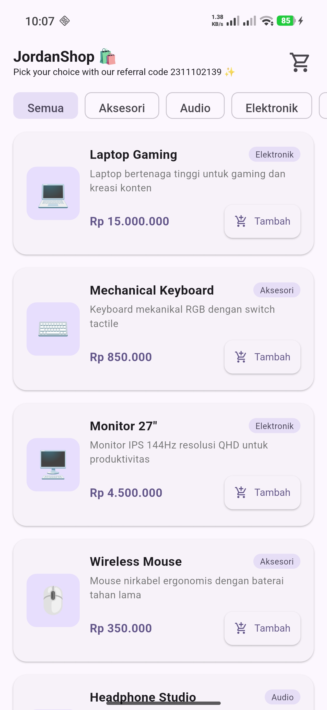
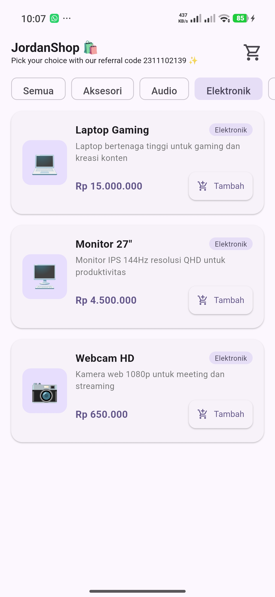
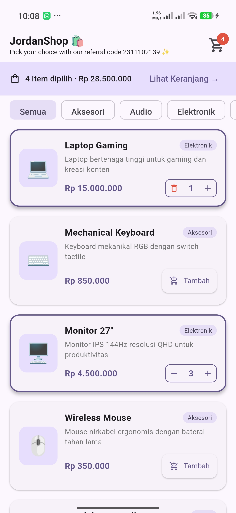
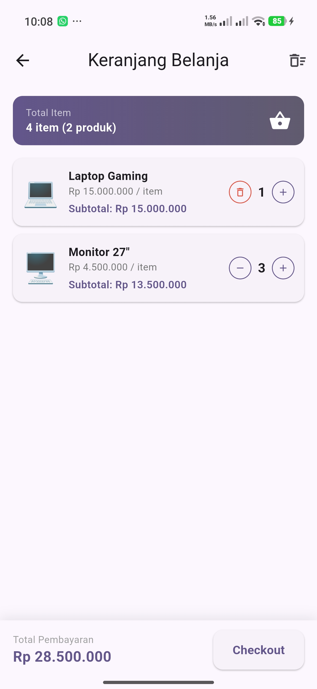
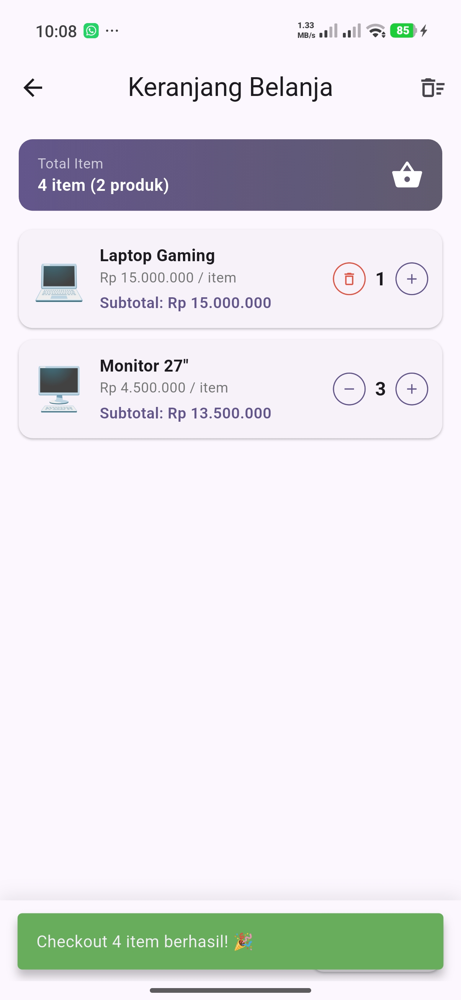

# JordanShop — Flutter BLoC/Cubit State Management

<div align="center">

**Praktikum Modul 15 — Modul Design Pattern BLoC dan Cubit pada Flutter**

| **Nama** | Jordan Angkawijaya |
|---|---|
| **NIM** | 2311102139 |

</div>

---

## 📱 Tampilan Aplikasi

<div align="center">

### 1. Tampilan Awal — Daftar Produk


*Halaman utama menampilkan seluruh produk beserta filter kategori. Cart badge di AppBar belum menampilkan angka karena keranjang masih kosong.*

---

### 2. Filter Kategori Elektronik


*Saat filter "Elektronik" dipilih, `setState` memfilter `dummyProducts` dan hanya menampilkan produk berkategori Elektronik (Laptop Gaming, Monitor 27", Webcam HD).*

---

### 3. Proses Menambahkan Produk ke Keranjang


*Setelah 1 Laptop Gaming dan 3 Monitor 27" ditambahkan. Badge keranjang di AppBar langsung menampilkan angka **4** dan strip info `"4 item dipilih · Rp 28.500.000"` muncul secara real-time karena `BlocBuilder` merespons setiap perubahan state dari `CartCubit`.*

---

### 4. Tampilan Keranjang — Jumlah Item Real-Time


*Halaman keranjang menampilkan summary banner "4 item (2 produk)", daftar item dengan subtotal masing-masing, dan total pembayaran Rp 28.500.000. Setiap klik tombol `+` / `−` langsung memperbarui tampilan karena `BlocBuilder` di-rebuild setiap `CartCubit` memanggil `emit()`.*

---

### 5. Checkout Berhasil


*Setelah tombol Checkout ditekan, muncul `SnackBar` berwarna hijau dengan pesan "Checkout 4 item berhasil! 🎉".*

</div>

---

## 🏗️ Penjelasan Implementasi BLoC/Cubit

Aplikasi ini menggunakan **Cubit**, yaitu versi sederhana dari BLoC yang tidak memerlukan `Event` class terpisah. Cubit cukup untuk use case seperti keranjang belanja karena aksi yang dilakukan bersifat langsung (tambah, kurangi, hapus).

### Komponen Utama

#### 1. `CartState` — Representasi State
```dart
// lib/cubit/cart_state.dart
class CartState extends Equatable {
  final Map<Product, int> items; // Produk → jumlah qty

  int get totalItems => items.values.fold(0, (sum, qty) => sum + qty);
  double get totalPrice => items.entries.fold(
    0, (sum, e) => sum + (e.key.price * e.value));
}
```
- State bersifat **immutable** (tidak dapat diubah langsung).
- Menggunakan `Equatable` agar Flutter dapat mendeteksi perubahan state secara efisien — `BlocBuilder` hanya rebuild jika nilai `props` benar-benar berbeda.
- Computed property `totalItems` dan `totalPrice` dihitung langsung dari `items`, sehingga selalu sinkron dengan data.

#### 2. `CartCubit` — Logika Bisnis
```dart
// lib/cubit/cart_cubit.dart
class CartCubit extends Cubit<CartState> {
  CartCubit() : super(CartState.initial());

  void addProduct(Product product) {
    final updated = Map<Product, int>.from(state.items);
    updated[product] = (updated[product] ?? 0) + 1;
    emit(state.copyWith(items: updated)); // ← emit state baru
  }

  void removeProduct(Product product) { ... }
  void deleteProduct(Product product) { ... }
  void clearCart() => emit(CartState.initial());
}
```
- Setiap method **membuat salinan** dari `state.items` (tidak mengubah langsung), lalu memanggil `emit()` dengan state baru.
- Pola ini menjamin **immutability** — state lama tidak pernah dimodifikasi, BLoC dapat melacak riwayat perubahan.

#### 3. `BlocProvider` — Penyedia State Global
```dart
// lib/main.dart
BlocProvider(
  create: (_) => CartCubit(),
  child: MaterialApp(...),
)
```
- `BlocProvider` ditempatkan di **root widget** (`main.dart`), sehingga satu instance `CartCubit` tersedia di **seluruh widget tree**.
- Ini memungkinkan `ProductListScreen` dan `CartScreen` berbagi state yang sama tanpa passing data manual antar widget.

#### 4. `BlocBuilder` — Rebuild UI Otomatis
```dart
// Contoh di product_list_screen.dart — badge keranjang
BlocBuilder<CartCubit, CartState>(
  builder: (context, state) {
    return Badge(
      label: Text('${state.totalItems}'), // ← update real-time
      child: Icon(Icons.shopping_cart),
    );
  },
)
```
- `BlocBuilder` **berlangganan** ke `CartCubit`. Setiap kali `emit()` dipanggil, `builder` dijalankan ulang dengan state terbaru.
- Digunakan di 4 lokasi berbeda:
  - `product_card.dart` → tampilan tombol "Tambah" berubah menjadi qty control `[−] N [+]`
  - `product_list_screen.dart` (AppBar) → badge angka di ikon keranjang
  - `product_list_screen.dart` (body) → strip info total item & harga
  - `cart_screen.dart` → summary banner, daftar item, tombol clear

### Alur Lengkap State Management

```
Pengguna klik "Tambah"
        │
        ▼
context.read<CartCubit>().addProduct(product)
        │
        ▼
CartCubit.addProduct()
  → buat Map baru (salinan state.items)
  → increment qty produk
  → emit(CartState(items: newMap))
        │
        ▼
BlocBuilder mendeteksi state baru (Equatable membandingkan props)
        │
        ▼
Semua BlocBuilder di-rebuild:
  ✓ Tombol "Tambah" → qty control [− 1 +]
  ✓ Badge AppBar: 0 → 1
  ✓ Strip info muncul: "1 item dipilih · Rp 15.000.000"
  ✓ Kartu produk mendapat border ungu (inCart = true)
```

### Tabel Aksi → Method → Efek State

| Aksi Pengguna | Method Cubit | Perubahan State |
|---|---|---|
| Klik "Tambah" | `addProduct(p)` | qty produk +1, emit state baru |
| Klik "−" saat qty > 1 | `removeProduct(p)` | qty produk −1, emit state baru |
| Klik "−" saat qty = 1 | `removeProduct(p)` | produk dihapus dari map |
| Swipe item di keranjang | `deleteProduct(p)` | produk langsung dihapus |
| Klik ikon hapus semua | `clearCart()` | emit `CartState.initial()` |

---

## 📁 Struktur Proyek

```
lib/
├── main.dart                      # Entry point + BlocProvider (global)
├── models/
│   └── product.dart               # Model Product + 8 data produk dummy
├── cubit/
│   ├── cart_state.dart            # CartState — representasi state (immutable)
│   └── cart_cubit.dart            # CartCubit — logika bisnis keranjang
├── screens/
│   ├── product_list_screen.dart   # Halaman daftar produk + filter kategori
│   └── cart_screen.dart           # Halaman keranjang belanja
└── widgets/
    └── product_card.dart          # Widget kartu produk dengan qty control
```

---

## 🚀 Cara Menjalankan

```bash
# 1. Masuk ke folder proyek
cd flutter_shop

# 2. Install dependencies
flutter pub get

# 3. Jalankan aplikasi
flutter run
```

**Dependencies:**
```yaml
flutter_bloc: ^8.1.5   # BLoC/Cubit state management
equatable: ^2.0.5      # Perbandingan state yang efisien
```