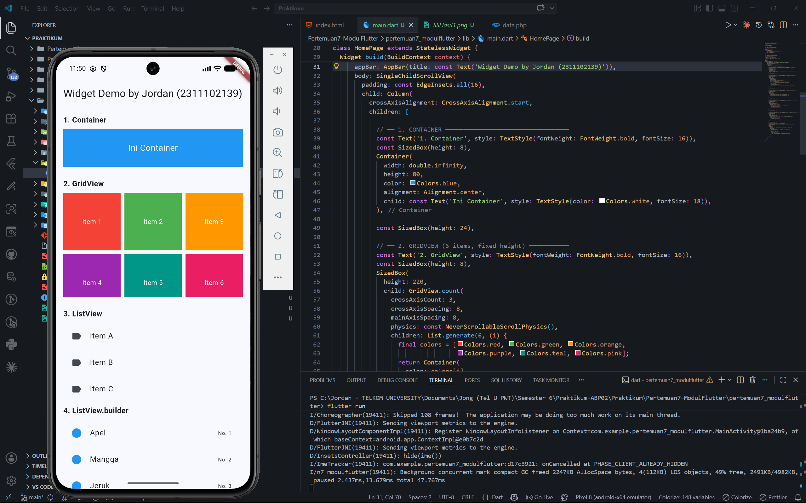
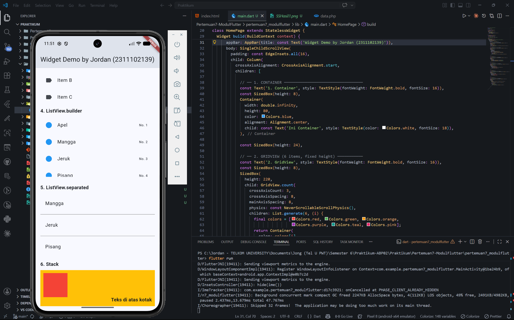

# Pertemuan 7 - Modul Flutter 1-5

**Nama:** Jordan Angkawijaya 
**NIM:** 2311102139  
**Mata Kuliah:** Praktikum ABP02

---

## Screenshot Hasil

---

## Penjelasan Singkat Tiap Widget

### 1. Container
Widget dasar yang digunakan untuk menampilkan kotak berwarna.
Container dapat dikustomisasi ukuran, warna, padding, margin, dan alignment-nya.
Pada project ini, Container menampilkan kotak biru dengan teks di tengah.

### 2. GridView
Widget yang menampilkan item-item dalam susunan grid (baris dan kolom).
Menggunakan `GridView.count` dengan `crossAxisCount: 3` sehingga terbentuk 2 baris × 3 kolom (6 item total).
Tiap item berupa Container berwarna berbeda.

### 3. ListView
Widget untuk menampilkan daftar item secara vertikal yang dapat di-scroll.
Pada project ini, ListView menampilkan 3 item statis: Item A, Item B, dan Item C menggunakan widget `ListTile`.

### 4. ListView.builder
Varian ListView yang membangun item secara dinamis dari sebuah array data.
Lebih efisien dibanding ListView biasa untuk data dalam jumlah banyak karena hanya merender item yang terlihat di layar.
Pada project ini, data bersumber dari list `buahList`.

### 5. ListView.separated
Varian ListView yang secara otomatis menambahkan pemisah (separator) antar item.
Menggunakan `separatorBuilder` untuk menentukan tampilan garis pembatas (`Divider`).
Cocok digunakan saat ingin tampilan list yang lebih terstruktur.

### 6. Stack
Widget yang menumpuk beberapa child widget di atas satu sama lain (seperti layer).
Menggunakan `Positioned` untuk menempatkan widget pada posisi tertentu di dalam Stack.
Pada project ini, terdapat Container kuning sebagai latar, Container merah di pojok kiri atas, dan teks di pojok kanan bawah.