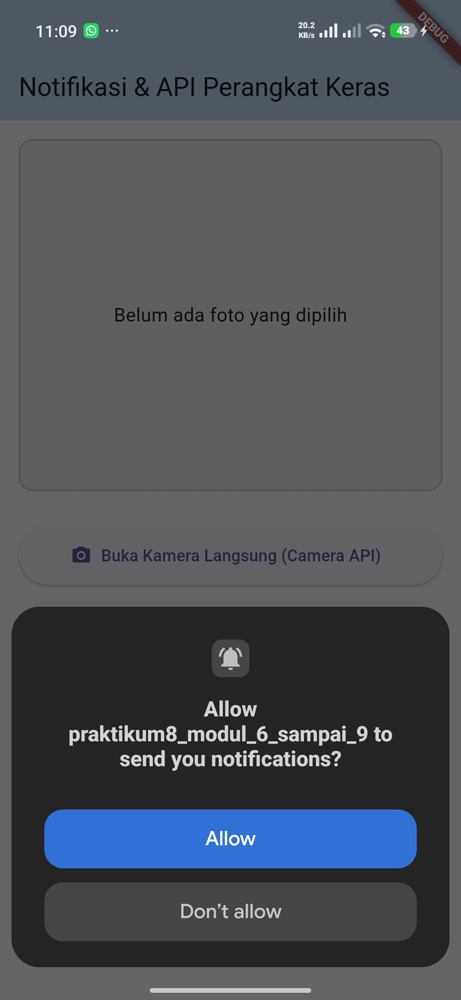
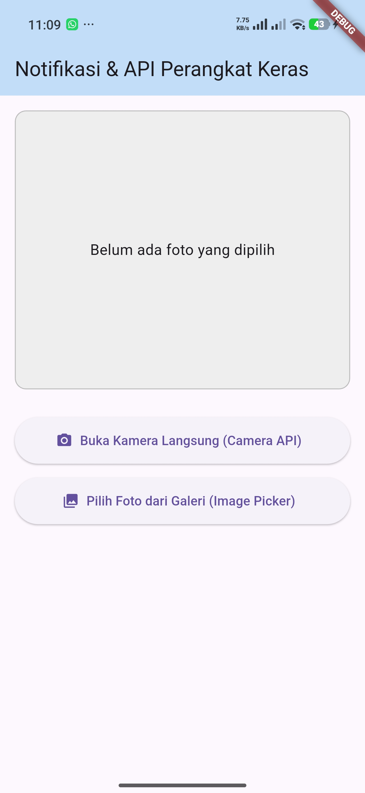
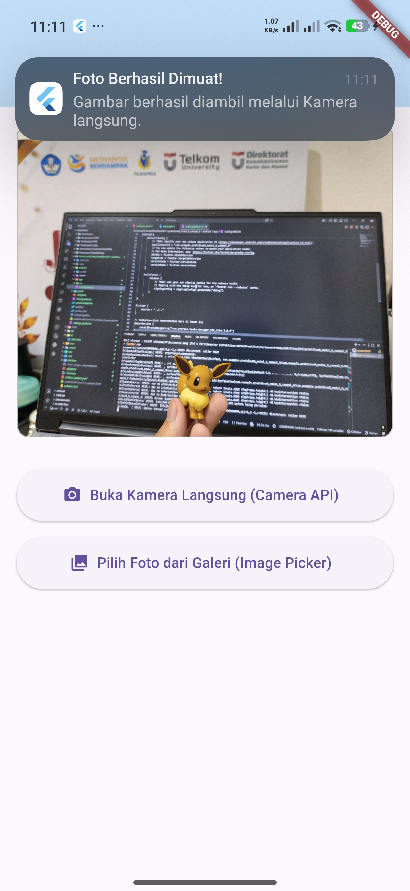
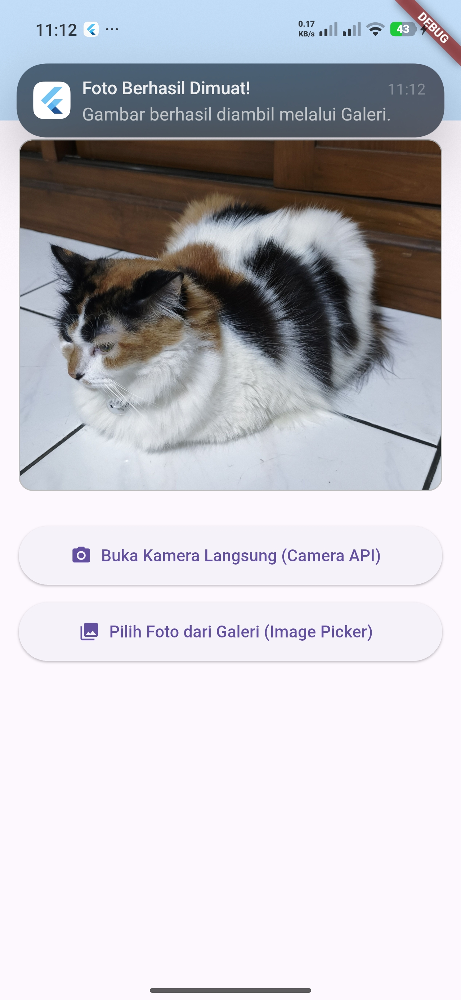

# Tugas Praktikum Pertemuan 8 (Modul 6 - 9): Notifikasi & API Perangkat Keras

Proyek ini merupakan aplikasi Flutter sederhana yang dibuat untuk memenuhi tugas praktikum mengenai integrasi API Perangkat Keras (Kamera dan Galeri) serta sistem Notifikasi Lokal pada perangkat Android.

---

## 🚀 Fitur Aplikasi
* **Ambil Foto (Kamera API):** Membuka kamera perangkat secara langsung untuk mengambil gambar.
* **Pilih Foto (Image Picker):** Mengakses galeri perangkat untuk memilih gambar yang sudah ada.
* **Tampilan Dinamis:** Menampilkan gambar yang berhasil diambil atau dipilih pada halaman utama.
* **Notifikasi Lokal:** Memicu *local notification* secara otomatis sesaat setelah gambar berhasil dimuat ke dalam aplikasi.

---

## 🛠️ Penjelasan Singkat Tiap Widget

Aplikasi ini dibangun menggunakan arsitektur widget bawaan Flutter untuk memastikan performa yang optimal dan antarmuka yang responsif:

* **`MaterialApp`** Widget akar (*root*) yang mengatur konfigurasi dasar aplikasi, termasuk penentuan tema global (Material 3) dan halaman utama (`home`).
* **`Scaffold`** Menyediakan struktur tata letak visual dasar seperti area `AppBar` dan `body` sebagai wadah utama seluruh komponen halaman.
* **`AppBar`** Menampilkan baris judul di bagian atas aplikasi sebagai penanda identitas halaman praktikum.
* **`SingleChildScrollView`** Berdampak pada fleksibilitas tata letak, mencegah terjadinya *layout overflow* dengan membuat halaman dapat digulir jika ukuran vertikal konten melebihi batas layar perangkat.
* **`Column`** Widget tata letak vertikal yang menyusun area penampung gambar dan tombol aksi secara berurutan dari atas ke bawah.
* **`Container`** Digunakan sebagai bingkai pembungkus (*placeholder*) area gambar dengan dekorasi khusus berupa warna latar belakang, radius sudut, dan garis tepi.
* **`Image.file`** Widget khusus yang bertugas merender dan menampilkan berkas gambar mentah berdasarkan jalur penyimpanan (*file path*) lokal dari perangkat.
* **`ClipRRect`** Memotong sudut tajam dari widget gambar agar mengikuti kelengkungan bingkai `Container` di luarnya sehingga visual terlihat lebih rapi.
* **`ElevatedButton.icon`** Tombol interaktif dengan efek bayangan yang menggabungkan ikon visual dan teks untuk memicu fungsi pembukaan kamera atau galeri.

---

## 📸 Dokumentasi Hasil Jalrun (Screenshots)

Berikut adalah rangkaian hasil pengujian aplikasi langsung pada perangkat fisik:

### 1. Izin Akses Notifikasi
Saat aplikasi pertama kali dijalankan, sistem akan meminta persetujuan pengguna untuk memunculkan notifikasi lokal.

### 2. Antarmuka Utama Aplikasi
Tampilan awal halaman utama sebelum pengguna memilih atau mengambil gambar. Area kontainer menampilkan teks indikator bawaan.

### 3. Hasil Pengujian Kamera (Camera API)
Tampilan setelah tombol kamera ditekan, gambar berhasil diambil, dan notifikasi sukses muncul di bagian atas layar.

### 4. Hasil Pengujian Galeri (Image Picker)
Tampilan setelah gambar dipilih dari galeri perangkat, berhasil dimuat ke kontainer utama, diikuti dengan pemanggilan notifikasi lokal yang sesuai.
