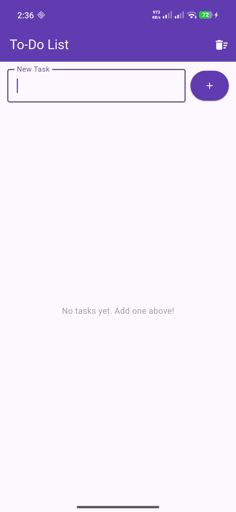
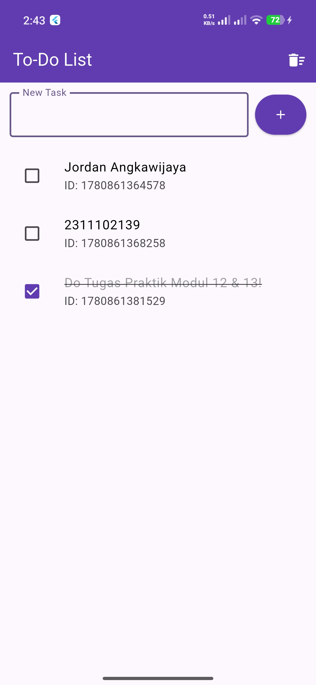
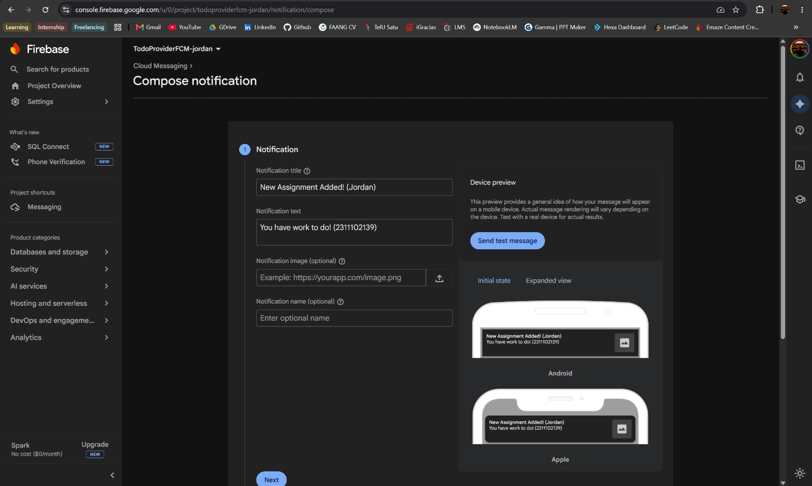
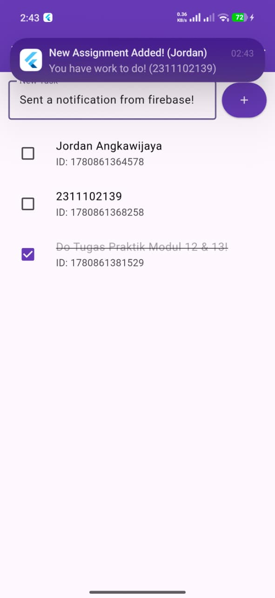

# Tugas Praktik Modul 12 & 13 — State Management Provider & Firebase Cloud Messaging

**Nama:** Jordan Angkawijaya  
**NIM:** 2311102139   

---

## Deskripsi Aplikasi

Aplikasi Flutter sederhana berbasis **To-Do List** yang mengimplementasikan dua konsep utama:

1. **State Management dengan Provider** — mengelola state daftar tugas secara reaktif
2. **Firebase Cloud Messaging (FCM)** — menerima push notification dari Firebase Console

---

## Fitur Aplikasi

- Menambahkan tugas baru melalui input field
- Menandai tugas sebagai selesai (checkbox dengan strikethrough)
- Menghapus seluruh tugas sekaligus (tombol trash di AppBar)
- Menerima push notification dari Firebase Console secara real-time

---

## Struktur Proyek

```
lib/
├── main.dart                  # Entry point, inisialisasi Firebase & Provider
├── models/
│   └── todo_model.dart        # Model data Todo (id, title, completed)
├── providers/
│   └── todo_provider.dart     # ChangeNotifier: addTodo, toggleTodo, clearAll
├── screens/
│   └── todo_screen.dart       # UI halaman utama To-Do List
└── services/
    └── fcm_service.dart       # Konfigurasi FCM & flutter_local_notifications
```

---

## Teknologi yang Digunakan

| Teknologi | Versi | Fungsi |
|---|---|---|
| Flutter | SDK stable | Framework utama |
| provider | ^6.1.2 | State management |
| firebase_core | ^3.6.0 | Inisialisasi Firebase |
| firebase_messaging | ^15.1.3 | Push notification (FCM) |
| flutter_local_notifications | ^17.2.2 | Menampilkan notifikasi saat foreground |

---

## Cara Menjalankan

```bash
# Clone atau buka folder proyek
cd praktikum_modul_12_13

# Install dependencies
flutter pub get

# Jalankan di perangkat/emulator
flutter run
```

> Pastikan file `google-services.json` sudah ada di dalam folder `android/app/`.

---

## Dokumentasi Hasil

### 1. Tampilan Awal Aplikasi

Aplikasi saat pertama dibuka menampilkan halaman To-Do List kosong dengan input field untuk menambah tugas dan tombol hapus di AppBar.



---

### 2. Proses Penambahan Tugas & Tampilan Daftar Tugas

Pengguna mengetikkan nama tugas lalu menekan tombol **+**. Tugas langsung muncul di daftar secara reaktif menggunakan Provider. Tugas yang sudah selesai dapat ditandai dengan checkbox, yang akan memberikan efek strikethrough pada teks.



---

### 3. Pengiriman Notifikasi via Firebase Console

Notifikasi dikirimkan melalui Firebase Console → Cloud Messaging → **Send test message**, menggunakan FCM token yang diperoleh dari debug log aplikasi.



---

### 4. Notifikasi Berhasil Diterima Aplikasi

Notifikasi dengan judul **"New Assignment Added! (Jordan)"** berhasil diterima dan muncul sebagai banner di atas layar perangkat saat aplikasi sedang berjalan di foreground.



---

## Cara Kerja State Management (Provider)

```
User Input (TextField)
        ↓
  TodoProvider.addTodo()
        ↓
  notifyListeners()
        ↓
  Consumer<TodoProvider> rebuild
        ↓
  ListView update otomatis
```

`TodoProvider` mewarisi `ChangeNotifier`. Setiap kali state berubah (tambah/hapus/toggle), `notifyListeners()` dipanggil dan semua widget yang terbungkus `Consumer` akan di-rebuild secara otomatis.

---

## Cara Kerja FCM

```
Firebase Console / Postman
        ↓
  FCM Server (Google)
        ↓
  firebase_messaging (onMessage listener)
        ↓
  flutter_local_notifications.show()
        ↓
  Notifikasi muncul di perangkat
```

Saat aplikasi berada di **foreground**, `FirebaseMessaging.onMessage.listen()` menangkap pesan dan meneruskannya ke `FlutterLocalNotificationsPlugin` untuk ditampilkan sebagai notifikasi lokal. Saat **background/terminated**, Firebase SDK menangani notifikasi secara otomatis melalui `firebaseBackgroundHandler`.

---

## Hasil Pengujian

| Fitur | Status |
|---|---|
| Tambah tugas baru | ✅ Berhasil |
| Tandai tugas selesai (checkbox) | ✅ Berhasil |
| Hapus seluruh tugas | ✅ Berhasil |
| Terima notifikasi FCM (foreground) | ✅ Berhasil |
| Integrasi Firebase | ✅ Berhasil |
